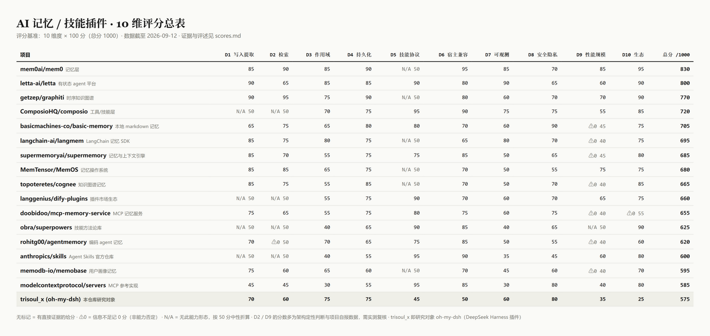

# AI Agent 记忆/技能插件评分基准与 GitHub 同类项目对照

产出日期：2026-09-12。本仓库是对 AI agent 的"记忆 / 技能"类插件的一套**10 维度 × 100 分（总分 1000）评分基准**，以及用它对 GitHub 上同类项目的横向对照。研究对象起点是 [gulagala001/trisoul_x](https://github.com/gulagala001/trisoul_x)（现重定向至 oh-my-dsh）。

> ⚠️ **引用前必读 [DISCLAIMER.md](DISCLAIMER.md)**：本仓库是公开信息整理与自建基准，非实测评测；总分不可单独引用。

## 仓库结构

| 文件 | 内容 |
|---|---|
| [trisoul-facts.md](trisoul-facts.md) | **阶段 0**：trisoul_x 事实摘要——形态（DeepSeek Harness 宿主插件 + Agent preset）、记忆机制（JSON 分层存储 / LLM 选取 + bigram 兜底检索）、技能侧形态、许可与分发方式，每条附仓库内来源文件路径 |
| [scoring-criteria.md](scoring-criteria.md) | **阶段 1**：10 维度评分基准——写入提取 / 检索 / 作用域 / 持久化 / 技能协议 / 宿主兼容 / 可观测 / 安全隐私 / 性能规模 / 生态维护，每维含 0/40/70/90/100 分档锚点与取证要求 |
| [candidates.md](candidates.md) | **阶段 2**：27 个 GitHub 同类候选（记忆类 16 / 技能类 8 / 两者兼有 3），记录定位、star（含核实状态）、活动、语言、维护状态与检索路径 |
| [scores.md](scores.md) | **阶段 3**：16 个筛出项目 + trisoul_x 的逐维打分总表与评述，trisoul_x 相对位置与短板分析 |

## 核心结论速览

- **trisoul_x = 575/1000**，在 17 个对照项目中排末位；但与同形态（单人维护的宿主旁挂记忆服务，如 agentmemory 620、mcp-memory-service 655）水位（550–650）一致。
- 其记忆内核（四层作用域 + 版本血缘 + 分片整理）并不落后；结构性短板是 **生态与许可（D10=25）、规模上限（D9=35）、宿主锁定（D6=50）、技能无协议（D5=45）**。
- 头部项目：mem0（830）、Letta（800）、graphiti（770）——三者分别胜在集成生态、agent 自编辑记忆、可复现评测（arXiv 论文）。

## 基准使用方法

1. 按 [scoring-criteria.md](scoring-criteria.md) 的"打分流程"：先按**实际暴露的接口**归类（记忆类/技能类/两者兼有），再逐维取证，N/A 维度按 50 折算，信息不足记 ⚠0。
2. 总分必须连同 10 个分项与 ⚠/N/A 标记一起读。
3. 评新项目前先做阶段 0 式事实核对，避免基准被单一项目实现细节绑架。

## 局限（摘要，全文见 DISCLAIMER.md）

- D2（检索质量）、D9（性能规模）为公开信息定性判断，**需实测复核**。
- star 数多为"未核实"（抓取期 API 不可达）；许可与活动数据截至 2026-09-12。
- 打分样本偏向证据可获取的头部项目；11 个证据不足候选未打分。

## License

本仓库内容采用 [CC BY 4.0](https://creativecommons.org/licenses/by/4.0/) 发布；文中引用的各项目名称与数据版权归原所有者。
